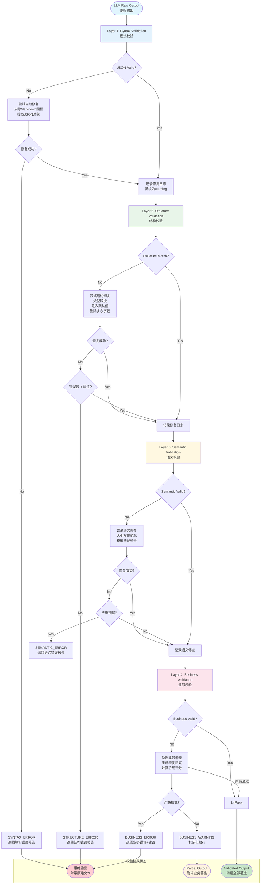

# Validation Compiler -- 四层校验思维链

> **版本**: v1.0 | **类型**: 校验编译器规范 | **状态**: 稳定

---

## 1. 概述

**Validation Compiler** 是 Intent-Schema-Compiler 体系中的核心校验后端，负责对 LLM 返回的原始输出执行**四层递进式校验**，确保输出在语法、结构、语义、业务四个维度均满足意图契约的要求。

### 1.1 设计哲学

四层校验模型的设计遵循以下核心原则：

| 原则 | 说明 |
|------|------|
| **防御纵深（Defense in Depth）** | 不依赖单层校验，通过四层递进构建纵深防线 |
| **快速失败（Fail Fast）** | 简单校验优先，尽早拦截明显错误，降低后续计算成本 |
| **渐进式修复（Graceful Degradation）** | 每层校验配备降级策略，部分失败时不全盘否定 |
| **可观测性（Observability）** | 每层校验产生结构化日志，支持全链路追踪与审计 |
| **契约驱动（Contract-Driven）** | 校验标准完全来源于 Intent Schema 契约定义，杜绝主观判断 |

### 1.2 四层模型概览

```
+-------------------------------------------------------------+
|                    LLM Raw Output                           |
|              (JSON string from LLM)                         |
+-------------------------------------------------------------+
                            |
                            v
+======================= LAYER 1 =============================
|  Syntax Validation  --  语法层                              |
|  目标: JSON 格式合法性                                       |
|  成本: O(n) 极低  |  拦截率: ~15% 的常见格式错误              |
+===========================================================+
                            |
                            v
+======================= LAYER 2 =============================
|  Structure Validation  --  结构层                            |
|  目标: Schema 结构匹配（字段存在性、类型一致性）               |
|  成本: O(f) 低   |  拦截率: ~25% 的结构偏差                  |
+===========================================================+
                            |
                            v
+======================= LAYER 3 =============================
|  Semantic Validation  --  语义层                             |
|  目标: 语义令牌正确性（枚举值、语义约束）                      |
|  成本: O(s) 中   |  拦截率: ~20% 的语义误用                  |
+===========================================================+
                            |
                            v
+======================= LAYER 4 =============================
|  Business Validation  --  业务层                             |
|  目标: 业务规则合规性（跨字段约束、业务逻辑）                   |
|  成本: O(b) 高   |  拦截率: ~10% 的业务违规                  |
+===========================================================+
                            |
                            v
+-------------------------------------------------------------+
|              Validated Output  /  Rejection Report           |
|         (通过全部四层 → 输出  |  任一层失败 → 报告)           |
+-------------------------------------------------------------+
```

### 1.3 校验流程指标

| 指标 | 值 |
|------|-----|
| **总拦截率** | ~70% 的常见 LLM 输出错误在四层校验中被拦截 |
| **平均校验延迟** | < 50ms（语法+结构）+ < 200ms（语义+业务） |
| **降级可用率** | 99.5%（即使业务层失败，仍返回前3层通过的部分结果） |

---

## 2. 四层校验详细说明

---

### Layer 1: Syntax Validation（语法层）

**目标**：验证 LLM 输出是否为合法的 JSON 格式字符串，确保基础解析不会失败。

**校验规则**：

| 规则编号 | 规则描述 | 严重级别 |
|----------|----------|----------|
| `S1-R01` | 输出必须是合法的 UTF-8 编码字符串 | `error` |
| `S1-R02` | 输出必须是合法的 JSON（可被标准解析器解析） | `error` |
| `S1-R03` | 输出不能包含 Markdown 代码围栏（```json ... ```） | `warning` |
| `S1-R04` | 输出不能包含 JSON 之外的解释性文本 | `warning` |
| `S1-R05` | JSON 不能有尾随逗号（trailing commas） | `error` |
| `S1-R06` | JSON 字符串必须使用双引号 | `error` |

**错误处理**：

| 错误码 | 触发条件 | 处理策略 |
|--------|----------|----------|
| `V1001` | JSON 解析失败 | 记录解析错误位置，尝试使用修复启发式（如去除代码围栏）后重试 |
| `V1002` | 包含 Markdown 围栏 | 自动提取围栏内内容后重试解析 |
| `V1003` | 包含额外文本 | 尝试提取第一个 JSON 对象后重试 |

**降级策略**：
- 语法层失败时，尝试**自动修复**（修复启发式 → 重解析 → 重校验）
- 若修复失败，返回 `SYNTAX_ERROR` 并附带原始输出供人工审查
- 不继续后续层校验（无意义的结构化输入）

```pseudocode
FUNCTION SyntaxValidation(rawOutput: String): SyntaxResult
    result = NEW SyntaxResult()
    result.layer = 1
    result.passed = TRUE
    result.errors = []
    result.warnings = []
    result.repaired_output = NULL

    // L1.1 UTF-8 编码验证
    IF NOT IsValidUTF8(rawOutput) THEN
        APPEND result.errors, {
            code: "V1001",
            rule: "S1-R01",
            message: "Output is not valid UTF-8 encoded",
            position: DetectEncodingError(rawOutput),
            severity: "error"
        }
        result.passed = FALSE
        RETURN result  // 编码错误无法修复
    END IF

    // L1.2 尝试直接 JSON 解析
    parseResult = TryJSONParse(rawOutput)

    IF parseResult.success THEN
        result.parsed_object = parseResult.value
    ELSE
        // L1.3 错误定位和修复启发式
        errorInfo = parseResult.error

        // 启发式 1: 去除 Markdown 代码围栏
        repaired = TryStripMarkdownFences(rawOutput)
        IF repaired.success THEN
            retryResult = TryJSONParse(repaired.value)
            IF retryResult.success THEN
                result.parsed_object = retryResult.value
                result.repaired_output = repaired.value
                APPEND result.warnings, {
                    code: "V1002",
                    rule: "S1-R03",
                    message: "Markdown fences were auto-removed",
                    severity: "warning"
                }
                GOTO L1_VALIDATED
            END IF
        END IF

        // 启发式 2: 提取第一个 JSON 对象
        repaired = TryExtractJSONObject(rawOutput)
        IF repaired.success THEN
            retryResult = TryJSONParse(repaired.value)
            IF retryResult.success THEN
                result.parsed_object = retryResult.value
                result.repaired_output = repaired.value
                APPEND result.warnings, {
                    code: "V1003",
                    rule: "S1-R04",
                    message: "Extracted JSON object from surrounding text",
                    severity: "warning"
                }
                GOTO L1_VALIDATED
            END IF
        END IF

        // L1.4 所有修复尝试失败
        APPEND result.errors, {
            code: "V1001",
            rule: "S1-R02",
            message: "JSON parse failed at line " + errorInfo.line +
                     ", column " + errorInfo.column + ": " + errorInfo.message,
            position: { line: errorInfo.line, column: errorInfo.column },
            severity: "error"
        }
        result.passed = FALSE
    END IF

L1_VALIDATED:
    // L1.5 尾随逗号检测
    IF ContainsTrailingCommas(rawOutput) AND result.repaired_output IS NULL THEN
        APPEND result.warnings, {
            code: "V1004",
            rule: "S1-R05",
            message: "Trailing commas detected in JSON (some parsers may reject)",
            severity: "warning"
        }
    END IF

    // L1.6 记录校验耗时
    result.elapsed_ms = TIMER_ELAPSED()

    RETURN result
END FUNCTION

// ---- 辅助函数 ----

FUNCTION TryJSONParse(text: String): ParseResult
    TRY
        parsed = JSON_PARSE(text)
        RETURN { success: TRUE, value: parsed, error: NULL }
    CATCH parseError
        RETURN { success: FALSE, value: NULL, error: parseError }
    END TRY
END FUNCTION

FUNCTION TryStripMarkdownFences(text: String): RepairResult
    // 匹配 ```json ... ``` 或 ``` ... ``` 模式
    pattern = REGEX("```(?:json)?\\s*\\n?([\\s\\S]*?)\\n?```")
    match = pattern.EXEC(text)
    IF match AND match.GROUP(1) THEN
        RETURN { success: TRUE, value: TRIM(match.GROUP(1)) }
    END IF
    RETURN { success: FALSE, value: NULL }
END FUNCTION

FUNCTION TryExtractJSONObject(text: String): RepairResult
    // 提取第一个 {...} 结构
    start = INDEX_OF(text, "{")
    end = FIND_MATCHING_BRACE(text, start)
    IF start >= 0 AND end > start THEN
        RETURN { success: TRUE, value: SUBSTRING(text, start, end - start + 1) }
    END IF
    RETURN { success: FALSE, value: NULL }
END FUNCTION

FUNCTION ContainsTrailingCommas(text: String): Boolean
    // 检测 ,} 和 ,] 模式
    RETURN REGEX_MATCH(text, ",\\s*[}\\]]")
END FUNCTION
```

---

### Layer 2: Structure Validation（结构层）

**目标**：验证解析后的 JSON 对象在结构上是否与 Intent Schema 定义匹配，包括字段存在性、类型一致性和数组结构。

**校验规则**：

| 规则编号 | 规则描述 | 严重级别 |
|----------|----------|----------|
| `S2-R01` | 所有 `required: true` 的字段必须存在且非 null | `error` |
| `S2-R02` | 所有字段的值类型必须与 Schema 定义的 `type` 一致 | `error` |
| `S2-R03` | 枚举（enum）类型字段的值必须在允许值列表内 | `error` |
| `S2-R04` | 数组（array）类型字段的元素必须与其 `item_schema` 一致 | `error` |
| `S2-R05` | 对象（object）类型字段的子字段必须符合其嵌套 Schema | `error` |
| `S2-R06` | 不允许出现 Schema 未定义的额外字段（除非 `additionalProperties: true`） | `warning` |
| `S2-R07` | 字符串（string）类型字段的取值必须符合格式模式（如 regex、date） | `error` |
| `S2-R08` | 数字（number）类型字段的取值必须在允许范围内 | `error` |

**错误处理**：

| 错误码 | 触发条件 | 处理策略 |
|--------|----------|----------|
| `V2001` | 必填字段缺失 | 标记为结构错误，若字段有默认值则注入默认值后降级 |
| `V2002` | 字段类型不匹配 | 尝试类型转换（如 "123" -> 123），失败则标记错误 |
| `V2003` | 枚举值不在允许列表 | 标记为错误，返回最接近的有效值建议 |
| `V2004` | 嵌套结构不匹配 | 递归校验嵌套对象，逐层标记偏差 |
| `V2005` | 存在未定义字段 | 发出警告，可选自动删除多余字段 |

**降级策略**：
- 必填字段缺失时，若 Schema 定义了 `default`，自动注入默认值并降级为警告
- 类型不匹配时，尝试安全的类型转换（如字符串到数字的解析）
- 未定义字段默认删除并降级为警告
- 结构层严重错误累积超过阈值时，停止后续层校验

```pseudocode
FUNCTION StructureValidation(
    parsedObject: Object,
    schema: IntentSchema,
    options: ValidationOptions = DEFAULT_OPTIONS
): StructureResult

    result = NEW StructureResult()
    result.layer = 2
    result.passed = TRUE
    result.errors = []
    result.warnings = []
    result.normalized_object = DEEP_COPY(parsedObject)
    result.field_status = {}  // 记录每个字段的校验状态

    // L2.1 校验所有 Schema 定义的字段
    FOR fieldDef IN schema.fields
        fieldName = fieldDef.name
        fieldValue = GET_FIELD(parsedObject, fieldName)
        fieldStatus = NEW FieldStatus()
        fieldStatus.name = fieldName
        fieldStatus.present = (fieldValue IS NOT UNDEFINED)
        fieldStatus.null = (fieldValue IS NULL)

        // L2.1.1 必填字段校验
        IF fieldDef.required THEN
            IF fieldValue IS UNDEFINED THEN
                // 尝试注入默认值
                IF fieldDef.default IS NOT NULL THEN
                    SET_FIELD(result.normalized_object, fieldName, fieldDef.default)
                    fieldStatus.has_default_applied = TRUE
                    APPEND result.warnings, {
                        code: "V2001",
                        rule: "S2-R01",
                        field: fieldName,
                        message: "Required field '" + fieldName +
                                 "' was missing; applied default: " + SERIALIZE(fieldDef.default),
                        severity: "warning"
                    }
                    fieldValue = fieldDef.default
                ELSE
                    fieldStatus.valid = FALSE
                    APPEND result.errors, {
                        code: "V2001",
                        rule: "S2-R01",
                        field: fieldName,
                        message: "Required field '" + fieldName + "' is missing",
                        severity: "error"
                    }
                    result.passed = FALSE
                    CONTINUE
                END IF
            ELSE IF fieldValue IS NULL THEN
                fieldStatus.valid = FALSE
                APPEND result.errors, {
                    code: "V2001",
                    rule: "S2-R01",
                    field: fieldName,
                    message: "Required field '" + fieldName + "' is null",
                    severity: "error"
                }
                result.passed = FALSE
                CONTINUE
            END IF
        END IF

        // 可选字段且未提供，跳过类型校验
        IF fieldValue IS UNDEFINED AND NOT fieldDef.required THEN
            fieldStatus.valid = TRUE
            fieldStatus.skipped = TRUE
            result.field_status[fieldName] = fieldStatus
            CONTINUE
        END IF

        // L2.1.2 类型校验
        typeMatch = ValidateFieldType(fieldValue, fieldDef, result, options)
        IF NOT typeMatch.valid THEN
            // 尝试类型修复
            IF options.auto_type_cast THEN
                castResult = TryTypeCast(fieldValue, fieldDef.type)
                IF castResult.success THEN
                    SET_FIELD(result.normalized_object, fieldName, castResult.value)
                    fieldValue = castResult.value
                    fieldStatus.type_cast_applied = TRUE
                    APPEND result.warnings, {
                        code: "V2002",
                        rule: "S2-R02",
                        field: fieldName,
                        message: "Auto-casted '" + fieldName + "' from " +
                                 TypeOf(fieldValue) + " to " + fieldDef.type,
                        severity: "warning"
                    }
                ELSE
                    result.passed = FALSE
                END IF
            ELSE
                result.passed = FALSE
            END IF
        END IF

        // L2.1.3 递归校验嵌套结构
        IF fieldDef.type == "object" AND fieldDef.fields IS NOT NULL AND fieldValue IS NOT NULL THEN
            nestedResult = StructureValidation(fieldValue, { fields: fieldDef.fields }, options)
            MERGE_ERRORS(result, nestedResult, fieldName + ".")
            MERGE_INTO(result.normalized_object, fieldName, nestedResult.normalized_object)
        ELSE IF fieldDef.type == "array" AND fieldDef.item_schema IS NOT NULL AND fieldValue IS NOT NULL THEN
            arrayResult = ValidateArrayElements(fieldValue, fieldDef.item_schema, fieldName, options)
            MERGE_ERRORS(result, arrayResult, fieldName + "[")
        END IF

        // L2.1.4 字符串格式校验
        IF fieldDef.type == "string" AND fieldDef.validation IS NOT NULL AND fieldValue IS NOT NULL THEN
            FOR rule IN fieldDef.validation
                IF rule.type == "regex" THEN
                    IF NOT REGEX_MATCH(fieldValue, rule.rule) THEN
                        APPEND result.errors, {
                            code: "V2007",
                            rule: "S2-R07",
                            field: fieldName,
                            message: "Value '" + fieldValue + "' does not match pattern: " + rule.rule,
                            severity: rule.severity
                        }
                        IF rule.severity == "error" THEN result.passed = FALSE
                    END IF
                ELSE IF rule.type == "length" THEN
                    strLen = LENGTH(fieldValue)
                    IF rule.rule.min IS NOT NULL AND strLen < rule.rule.min THEN
                        APPEND result.errors, {
                            code: "V2007",
                            rule: "S2-R07",
                            field: fieldName,
                            message: "Length " + strLen + " < minimum " + rule.rule.min,
                            severity: rule.severity
                        }
                        IF rule.severity == "error" THEN result.passed = FALSE
                    END IF
                    IF rule.rule.max IS NOT NULL AND strLen > rule.rule.max THEN
                        APPEND result.errors, {
                            code: "V2007",
                            rule: "S2-R07",
                            field: fieldName,
                            message: "Length " + strLen + " > maximum " + rule.rule.max,
                            severity: rule.severity
                        }
                        IF rule.severity == "error" THEN result.passed = FALSE
                    END IF
                END IF
            END FOR
        END IF

        fieldStatus.valid = (COUNT_ERRORS_FOR_FIELD(result, fieldName) == 0)
        result.field_status[fieldName] = fieldStatus
    END FOR

    // L2.2 检测未定义字段
    IF NOT schema.additional_properties THEN
        actualKeys = KEYS(parsedObject)
        schemaKeys = MAP(schema.fields, f -> f.name)
        extraKeys = FILTER(actualKeys, k -> NOT CONTAINS(schemaKeys, k))
        FOR extraKey IN extraKeys
            IF options.auto_remove_extra_fields THEN
                DELETE_FIELD(result.normalized_object, extraKey)
                APPEND result.warnings, {
                    code: "V2005",
                    rule: "S2-R06",
                    field: extraKey,
                    message: "Undefined field '" + extraKey + "' was auto-removed",
                    severity: "warning"
                }
            ELSE
                APPEND result.warnings, {
                    code: "V2005",
                    rule: "S2-R06",
                    field: extraKey,
                    message: "Undefined field '" + extraKey + "' present in output",
                    severity: "warning"
                }
            END IF
        END FOR
    END IF

    // L2.3 严重错误阈值检查
    errorCount = LENGTH(FILTER(result.errors, e -> e.severity == "error"))
    IF errorCount > options.max_structure_errors THEN
        result.aborted = TRUE
        result.abort_reason = "Too many structure errors: " + errorCount +
                              " > threshold " + options.max_structure_errors
    END IF

    result.elapsed_ms = TIMER_ELAPSED()
    RETURN result
END FUNCTION

FUNCTION ValidateFieldType(
    value: Any,
    fieldDef: FieldNode,
    result: StructureResult,
    options: ValidationOptions
): TypeValidationResult

    expectedType = fieldDef.type
    actualType = JSONTypeOf(value)

    // 类型映射表
    typeCompatibility = {
        "string":  ["string"],
        "number":  ["number", "integer"],
        "integer": ["integer", "number"],
        "boolean": ["boolean"],
        "array":   ["array"],
        "object":  ["object"],
        "null":    ["null"]
    }

    compatibleTypes = typeCompatibility[expectedType] OR [expectedType]

    IF CONTAINS(compatibleTypes, actualType) THEN
        // 枚举值校验（enum 类型或带 allowed_values 的字段）
        IF fieldDef.allowed_values IS NOT NULL AND NOT CONTAINS(fieldDef.allowed_values, value) THEN
            APPEND result.errors, {
                code: "V2003",
                rule: "S2-R03",
                field: fieldDef.name,
                message: "Value '" + value + "' not in allowed values: " +
                         JOIN(fieldDef.allowed_values, ", ") +
                         ". Did you mean: '" + FindClosestMatch(value, fieldDef.allowed_values) + "'?",
                severity: "error"
            }
            RETURN { valid: FALSE, cast_applied: FALSE }
        END IF
        RETURN { valid: TRUE, cast_applied: FALSE }
    END IF

    // 类型不匹配
    APPEND result.errors, {
        code: "V2002",
        rule: "S2-R02",
        field: fieldDef.name,
        message: "Expected type '" + expectedType + "' but got '" + actualType +
                 "' for field '" + fieldDef.name + "'",
        severity: "error"
    }
    RETURN { valid: FALSE, cast_applied: FALSE }
END FUNCTION

FUNCTION TryTypeCast(value: Any, targetType: String): CastResult
    TRY
        SWITCH targetType
            CASE "string":
                RETURN { success: TRUE, value: TO_STRING(value) }
            CASE "number":
                IF IS_STRING(value) THEN
                    parsed = PARSE_FLOAT(value)
                    IF NOT IS_NAN(parsed) THEN
                        RETURN { success: TRUE, value: parsed }
                    END IF
                END IF
            CASE "integer":
                IF IS_STRING(value) THEN
                    parsed = PARSE_INT(value)
                    IF NOT IS_NAN(parsed) THEN
                        RETURN { success: TRUE, value: parsed }
                    END IF
                ELSE IF IS_NUMBER(value) THEN
                    RETURN { success: TRUE, value: FLOOR(value) }
                END IF
            CASE "boolean":
                IF IS_STRING(value) THEN
                    lowerVal = LOWERCASE(value)
                    IF lowerVal IN ["true", "1", "yes"] THEN
                        RETURN { success: TRUE, value: TRUE }
                    ELSE IF lowerVal IN ["false", "0", "no"] THEN
                        RETURN { success: TRUE, value: FALSE }
                    END IF
                END IF
        END SWITCH
        RETURN { success: FALSE, value: NULL }
    CATCH
        RETURN { success: FALSE, value: NULL }
    END TRY
END FUNCTION

FUNCTION ValidateArrayElements(
    array: List,
    itemSchema: FieldNode,
    parentField: String,
    options: ValidationOptions
): ArrayValidationResult

    result = NEW ArrayValidationResult()
    result.passed = TRUE
    result.errors = []

    FOR i FROM 0 TO LENGTH(array) - 1
        item = array[i]
        itemType = JSONTypeOf(item)
        expectedType = itemSchema.type

        IF itemType != expectedType THEN
            APPEND result.errors, {
                code: "V2004",
                rule: "S2-R04",
                field: parentField + "[" + i + "]",
                message: "Array item [" + i + "] expected type '" + expectedType +
                         "' but got '" + itemType + "'",
                severity: "error"
            }
            result.passed = FALSE
        END IF

        // 嵌套对象校验
        IF expectedType == "object" AND itemSchema.fields IS NOT NULL THEN
            nested = StructureValidation(item, { fields: itemSchema.fields }, options)
            MERGE_ERRORS(result, nested, parentField + "[" + i + "]")
        END IF
    END FOR

    RETURN result
END FUNCTION

FUNCTION FindClosestMatch(value: String, candidates: List<String>): String
    // 使用编辑距离找到最相似的候选值
    bestMatch = candidates[0]
    bestDistance = INFINITY
    FOR candidate IN candidates
        dist = LevenshteinDistance(value, candidate)
        IF dist < bestDistance THEN
            bestDistance = dist
            bestMatch = candidate
        END IF
    END FOR
    RETURN bestMatch
END FUNCTION
```

---

### Layer 3: Semantic Validation（语义层）

**目标**：验证字段值在使用语义令牌时的正确性，确保枚举值、语义引用和领域本体的一致性。

**校验规则**：

| 规则编号 | 规则描述 | 严重级别 |
|----------|----------|----------|
| `S3-R01` | 语义令牌引用的值必须在令牌词典的允许范围内 | `error` |
| `S3-R02` | 语义令牌值必须使用正确的规范形式（大小写、格式） | `error` |
| `S3-R03` | 语义令牌值必须与引用的本体（ontology）定义一致 | `warning` |
| `S3-R04` | 复合语义字段（如日期范围）的逻辑关系必须自洽 | `error` |
| `S3-R05` | 互斥语义值不能同时出现 | `error` |
| `S3-R06` | 语义层级关系必须合法（如 severity 的递进关系） | `warning` |

**错误处理**：

| 错误码 | 触发条件 | 处理策略 |
|--------|----------|----------|
| `V3001` | 语义值不在令牌词典中 | 使用词典中最接近的值替换，并降级 |
| `V3002` | 语义值大小写/格式错误 | 自动规范化（如 "Critical" -> "critical"） |
| `V3003` | 语义值与本体定义冲突 | 标记警告，提供本体引用供人工确认 |
| `V3004` | 语义逻辑不自洽 | 标记错误，尝试推导合理值 |

**降级策略**：
- 大小写不匹配时自动规范化并降级为警告
- 值不在词典中时，使用编辑距离最近的有效值替换并降级
- 语义层失败不影响结构层已通过的结果

```pseudocode
FUNCTION SemanticValidation(
    normalizedObject: Object,
    schema: IntentSchema,
    tokenDictionary: TokenDictionary,
    options: ValidationOptions
): SemanticResult

    result = NEW SemanticResult()
    result.layer = 3
    result.passed = TRUE
    result.errors = []
    result.warnings = []
    result.canonicalized_object = DEEP_COPY(normalizedObject)
    result.semantic_fixes = []  // 记录所有语义修复

    // L3.1 收集所有带语义令牌的字段
    semanticFields = FILTER(schema.fields, f -> f.semantic_token IS NOT NULL)

    FOR fieldDef IN semanticFields
        fieldName = fieldDef.name
        fieldValue = GET_FIELD(normalizedObject, fieldName)

        // 跳过未提供的可选字段
        IF fieldValue IS UNDEFINED OR fieldValue IS NULL THEN
            CONTINUE
        END IF

        tokenName = EXTRACT_TOKEN_NAME(fieldDef.semantic_token)

        IF NOT CONTAINS(tokenDictionary, tokenName) THEN
            APPEND result.warnings, {
                code: "V3003",
                rule: "S3-R03",
                field: fieldName,
                message: "Semantic token '" + tokenName + "' not in dictionary; skipping semantic validation",
                severity: "warning"
            }
            CONTINUE
        END IF

        tokenDef = tokenDictionary[tokenName]

        // L3.2 令牌允许值校验
        IF tokenDef.allowed_values IS NOT NULL THEN
            allowedValues = tokenDef.allowed_values
            canonicalValues = MAP(allowedValues, v -> Canonicalize(v, tokenDef.format_pattern))
            inputCanonical = Canonicalize(fieldValue, tokenDef.format_pattern)

            IF NOT CONTAINS(canonicalValues, inputCanonical) THEN
                // L3.2.1 尝试规范化修复（大小写、格式等）
                closestMatch = FindClosestSemanticMatch(inputCanonical, canonicalValues)

                IF closestMatch.distance == 0 THEN
                    // 规范化后匹配（如大小写不同）
                    SET_FIELD(result.canonicalized_object, fieldName, closestMatch.value)
                    APPEND result.semantic_fixes, {
                        field: fieldName,
                        original: fieldValue,
                        fixed: closestMatch.value,
                        reason: "auto-canonicalized"
                    }
                    APPEND result.warnings, {
                        code: "V3002",
                        rule: "S3-R02",
                        field: fieldName,
                        message: "Value '" + fieldValue + "' auto-canonicalized to '" +
                                 closestMatch.value + "' (format: " + tokenDef.format_pattern + ")",
                        severity: "warning"
                    }
                ELSE IF closestMatch.distance <= options.max_semantic_distance THEN
                    // 在容差范围内，替换为最接近值
                    SET_FIELD(result.canonicalized_object, fieldName, closestMatch.value)
                    APPEND result.semantic_fixes, {
                        field: fieldName,
                        original: fieldValue,
                        fixed: closestMatch.value,
                        reason: "fuzzy-matched (distance: " + closestMatch.distance + ")"
                    }
                    APPEND result.warnings, {
                        code: "V3001",
                        rule: "S3-R01",
                        field: fieldName,
                        message: "Value '" + fieldValue + "' not in allowed set; " +
                                 "replaced with closest match '" + closestMatch.value + "'",
                        severity: "warning"
                    }
                ELSE
                    // 超出容差，标记错误
                    APPEND result.errors, {
                        code: "V3001",
                        rule: "S3-R01",
                        field: fieldName,
                        message: "Value '" + fieldValue + "' is not a valid '" +
                                 tokenName + "'. Allowed: " + JOIN(allowedValues, ", ") +
                                 ". Closest match: '" + closestMatch.value + "'",
                        severity: "error"
                    }
                    result.passed = FALSE
                END IF
            ELSE
                // L3.2.2 值有效，确保使用规范形式
                SET_FIELD(result.canonicalized_object, fieldName, inputCanonical)
            END IF
        END IF

        // L3.3 本体一致性校验
        IF tokenDef.ontology_ref IS NOT NULL THEN
            ontologyValid = CheckOntologyConsistency(
                GET_FIELD(result.canonicalized_object, fieldName),
                tokenDef.ontology_ref
            )
            IF NOT ontologyValid THEN
                APPEND result.warnings, {
                    code: "V3003",
                    rule: "S3-R03",
                    field: fieldName,
                    message: "Value may conflict with ontology '" + tokenDef.ontology_ref +
                             "'; manual review recommended",
                    severity: "warning"
                }
            END IF
        END IF

        // L3.4 互斥值校验
        IF tokenDef.mutually_exclusive_with IS NOT NULL THEN
            FOR mutexTokenRef IN tokenDef.mutually_exclusive_with
                mutexFieldName = FIND_FIELD_BY_TOKEN(schema, mutexTokenRef)
                IF mutexFieldName IS NOT NULL THEN
                    mutexValue = GET_FIELD(normalizedObject, mutexFieldName)
                    IF mutexValue IS NOT NULL AND fieldValue IS NOT NULL THEN
                        APPEND result.errors, {
                            code: "V3004",
                            rule: "S3-R05",
                            field: fieldName + "/" + mutexFieldName,
                            message: "Fields '" + fieldName + "' and '" + mutexFieldName +
                                     "' are mutually exclusive; both have values",
                            severity: "error"
                        }
                        result.passed = FALSE
                    END IF
                END IF
            END FOR
        END IF
    END FOR

    // L3.5 语义层级关系校验（如 severity 递进）
    FOR fieldDef IN semanticFields
        IF fieldDef.semantic_token IS NOT NULL THEN
            tokenName = EXTRACT_TOKEN_NAME(fieldDef.semantic_token)
            tokenDef = tokenDictionary[tokenName]

            IF tokenDef.hierarchy IS NOT NULL THEN
                fieldValue = GET_FIELD(result.canonicalized_object, fieldDef.name)
                IF fieldValue IS NOT NULL THEN
                    hierarchyIndex = INDEX_OF(tokenDef.hierarchy, fieldValue)

                    // 检查与相关字段的层级一致性
                    IF tokenDef.hierarchy_constraints IS NOT NULL THEN
                        FOR constraint IN tokenDef.hierarchy_constraints
                            relatedField = constraint.field
                            relatedValue = GET_FIELD(normalizedObject, relatedField)
                            IF relatedValue IS NOT NULL THEN
                                constraintCheck = CheckHierarchyConstraint(
                                    fieldValue, hierarchyIndex,
                                    relatedValue, constraint
                                )
                                IF NOT constraintCheck.valid THEN
                                    APPEND result.warnings, {
                                        code: "V3004",
                                        rule: "S3-R06",
                                        field: fieldDef.name,
                                        message: constraintCheck.message,
                                        severity: "warning"
                                    }
                                END IF
                            END IF
                        END FOR
                    END IF
                END IF
            END IF
        END IF
    END FOR

    result.elapsed_ms = TIMER_ELAPSED()
    RETURN result
END FUNCTION

FUNCTION Canonicalize(value: String, formatPattern: String): String
    SWITCH formatPattern
        CASE "lowercase string":
            RETURN LOWERCASE(TO_STRING(value))
        CASE "UPPERCASE STRING":
            RETURN UPPERCASE(TO_STRING(value))
        CASE "CamelCase":
            RETURN ToCamelCase(TO_STRING(value))
        CASE "snake_case":
            RETURN ToSnakeCase(TO_STRING(value))
        CASE "kebab-case":
            RETURN ToKebabCase(TO_STRING(value))
        DEFAULT:
            RETURN TO_STRING(value)
    END SWITCH
END FUNCTION

FUNCTION FindClosestSemanticMatch(input: String, candidates: List<String>): SemanticMatch
    bestCandidate = candidates[0]
    bestScore = INFINITY

    FOR candidate IN candidates
        // 组合距离：编辑距离 + 前缀匹配惩罚
        editDist = LevenshteinDistance(input, candidate)
        prefixBonus = (STARTS_WITH(candidate, SUBSTRING(input, 0, 2))) ? -2 : 0
        score = editDist + prefixBonus

        IF score < bestScore THEN
            bestScore = score
            bestCandidate = candidate
        END IF
    END FOR

    RETURN { value: bestCandidate, distance: bestScore }
END FUNCTION

FUNCTION CheckOntologyConsistency(value: String, ontologyRef: String): Boolean
    // 查询外部或缓存的本体定义
    ontologyDef = OntologyRegistry.LOOKUP(ontologyRef)
    IF ontologyDef IS NULL THEN
        RETURN TRUE  // 本体不可用，跳过校验
    END IF
    RETURN CONTAINS(ontologyDef.valid_values, value)
END FUNCTION

FUNCTION CheckHierarchyConstraint(
    valueA: String, indexA: Integer,
    valueB: String, constraint: HierarchyConstraint
): ConstraintCheck
    indexB = INDEX_OF(constraint.hierarchy, valueB)
    IF indexB < 0 THEN
        RETURN { valid: FALSE, message: "Related value '" + valueB + "' not in hierarchy" }
    END IF

    SWITCH constraint.operator
        CASE ">=":
            valid = (indexA >= indexB)
        CASE "<=":
            valid = (indexA <= indexB)
        CASE "==":
            valid = (indexA == indexB)
        CASE "!=":
            valid = (indexA != indexB)
        DEFAULT:
            valid = TRUE
    END SWITCH

    IF NOT valid THEN
        RETURN {
            valid: FALSE,
            message: "Hierarchy constraint violated: '" + valueA +
                     "' (level " + indexA + ") should be " + constraint.operator +
                     " '" + valueB + "' (level " + indexB + ")"
        }
    END IF
    RETURN { valid: TRUE, message: "" }
END FUNCTION
```

---

### Layer 4: Business Validation（业务层）

**目标**：验证输出在业务规则层面的合规性，包括跨字段约束、业务逻辑、上下文一致性等高级校验。

**校验规则**：

| 规则编号 | 规则描述 | 严重级别 |
|----------|----------|----------|
| `S4-R01` | 跨字段依赖约束必须满足（如 A 存在时 B 必须存在） | `error` |
| `S4-R02` | 条件约束必须满足（如 severity=critical 时必须提供 action） | `error` |
| `S4-R03` | 业务逻辑一致性约束（如时间顺序合理、数值关系自洽） | `error` |
| `S4-R04` | 上下文一致性（如输出与输入上下文的相关性） | `warning` |
| `S4-R05` | 业务规则自定义校验（通过插件机制注入） | `configurable` |
| `S4-R06` | 重复/冗余检测（如与历史输出的重复性检查） | `warning` |

**错误处理**：

| 错误码 | 触发条件 | 处理策略 |
|--------|----------|----------|
| `V4001` | 跨字段依赖违反 | 尝试自动推导缺失字段，失败则标记错误 |
| `V4002` | 条件约束违反 | 根据条件推导正确值，或标记为错误 |
| `V4003` | 业务逻辑不一致 | 标记错误，提供修复建议 |
| `V4004` | 上下文不匹配 | 降级为警告，记录上下文偏差 |
| `V4005` | 自定义规则失败 | 根据规则配置的严重级别处理 |

**降级策略**：
- 业务层校验失败默认**不阻止输出传递**，但标记为 `business_warning` 状态
- 可通过配置 `business_rules_are_strict: true` 将业务层提升为阻断级
- 提供修复建议（remediation suggestions）供上游决策
- 记录完整业务校验日志用于审计

```pseudocode
FUNCTION BusinessValidation(
    canonicalizedObject: Object,
    schema: IntentSchema,
    context: RuntimeContext,
    businessRules: List<BusinessRule>,
    options: ValidationOptions
): BusinessResult

    result = NEW BusinessResult()
    result.layer = 4
    result.passed = TRUE
    result.errors = []
    result.warnings = []
    result.remediation_suggestions = []
    result.business_score = 1.0  // 业务合规评分 0.0-1.0

    // L4.1 执行 Schema 定义的约束
    FOR constraint IN schema.constraints
        constraintResult = EvaluateConstraint(constraint, canonicalizedObject, schema)

        IF NOT constraintResult.satisfied THEN
            severity = constraint.severity
            IF severity == "error" THEN
                result.passed = FALSE
                result.business_score -= 0.25
                APPEND result.errors, {
                    code: "V4001",
                    rule: "S4-R01/S4-R02",
                    constraint_type: constraint.type,
                    message: constraintResult.message,
                    severity: "error",
                    suggestion: constraintResult.suggestion
                }
            ELSE
                result.business_score -= 0.1
                APPEND result.warnings, {
                    code: "V4001",
                    rule: "S4-R01",
                    constraint_type: constraint.type,
                    message: constraintResult.message,
                    severity: "warning"
                }
            END IF

            IF constraintResult.suggestion IS NOT NULL THEN
                APPEND result.remediation_suggestions, constraintResult.suggestion
            END IF
        END IF
    END FOR

    // L4.2 执行业务逻辑一致性校验
    logicResult = ValidateBusinessLogic(canonicalizedObject, schema, context)
    MERGE(result.errors, logicResult.errors)
    MERGE(result.warnings, logicResult.warnings)
    IF LENGTH(logicResult.errors) > 0 THEN
        result.passed = FALSE
        result.business_score -= LENGTH(logicResult.errors) * 0.2
    END IF

    // L4.3 执行自定义业务规则
    FOR rule IN businessRules
        ruleResult = rule.EVALUATE(canonicalizedObject, context)

        IF NOT ruleResult.passed THEN
            effectiveSeverity = rule.severity  // configurable per rule
            IF effectiveSeverity == "error" THEN
                result.passed = FALSE
                result.business_score -= 0.15
                APPEND result.errors, {
                    code: "V4005",
                    rule: "S4-R05",
                    rule_id: rule.id,
                    message: ruleResult.message,
                    severity: "error"
                }
            ELSE
                result.business_score -= 0.05
                APPEND result.warnings, {
                    code: "V4005",
                    rule: "S4-R05",
                    rule_id: rule.id,
                    message: ruleResult.message,
                    severity: "warning"
                }
            END IF
        END IF
    END FOR

    // L4.4 上下文一致性校验
    IF context IS NOT NULL THEN
        contextResult = ValidateContextConsistency(canonicalizedObject, context)
        MERGE(result.warnings, contextResult.warnings)
        IF LENGTH(contextResult.warnings) > 0 THEN
            result.business_score -= LENGTH(contextResult.warnings) * 0.05
        END IF
    END IF

    // L4.5 重复性/冗余检测
    IF options.check_redundancy AND context.history IS NOT NULL THEN
        redundancyResult = CheckRedundancy(canonicalizedObject, context.history)
        IF redundancyResult.is_redundant THEN
            result.business_score -= 0.1
            APPEND result.warnings, {
                code: "V4004",
                rule: "S4-R06",
                message: "Output is similar to recent output (similarity: " +
                         redundancyResult.similarity_score + ")",
                severity: "warning"
            }
        END IF
    END IF

    // L4.6 业务评分边界处理
    result.business_score = MAX(0.0, MIN(1.0, result.business_score))

    // L4.7 严格模式处理
    IF options.business_rules_are_strict AND LENGTH(result.warnings) > 0 THEN
        FOR warning IN result.warnings
            CONVERT_TO_ERROR(warning)
        END FOR
        result.passed = FALSE
        result.errors = CONCAT(result.errors, result.warnings)
        result.warnings = []
    END IF

    result.elapsed_ms = TIMER_ELAPSED()
    RETURN result
END FUNCTION

FUNCTION EvaluateConstraint(
    constraint: ConstraintNode,
    object: Object,
    schema: IntentSchema
): ConstraintEvaluation

    SWITCH constraint.type
        CASE "dependency":
            // 跨字段依赖: target_field 存在时 dependee 必须存在
            RETURN EvaluateDependencyConstraint(constraint, object)

        CASE "conditional":
            // 条件约束: 条件满足时规则必须成立
            RETURN EvaluateConditionalConstraint(constraint, object)

        CASE "range":
            // 范围约束: 数值在指定范围内
            RETURN EvaluateRangeConstraint(constraint, object)

        CASE "regex":
            // 正则约束: 字符串匹配模式
            RETURN EvaluateRegexConstraint(constraint, object)

        CASE "uniqueness":
            // 唯一性约束: 值在集合中唯一
            RETURN EvaluateUniquenessConstraint(constraint, object)

        CASE "custom":
            // 自定义约束: 通过表达式引擎执行
            RETURN EvaluateCustomConstraint(constraint, object)

        DEFAULT:
            RETURN {
                satisfied: TRUE,
                message: "Unknown constraint type '" + constraint.type + "'; skipping"
            }
    END SWITCH
END FUNCTION

FUNCTION EvaluateDependencyConstraint(constraint: ConstraintNode, object: Object): ConstraintEvaluation
    targetField = constraint.target_field
    targetValue = GET_FIELD(object, targetField)

    // 解析规则: "required when <field> == <value>" 或 "<field_A> depends on <field_B>"
    ruleSpec = PARSE_DEPENDENCY_RULE(constraint.rule)

    IF ruleSpec.type == "required_when" THEN
        conditionField = ruleSpec.condition_field
        conditionValue = ruleSpec.condition_value
        actualConditionValue = GET_FIELD(object, conditionField)

        IF actualConditionValue == conditionValue AND (targetValue IS NULL OR targetValue IS UNDEFINED) THEN
            RETURN {
                satisfied: FALSE,
                message: "Field '" + targetField + "' is required when '" +
                         conditionField + "' == '" + conditionValue + "'",
                suggestion: "Add '" + targetField + "' with appropriate value"
            }
        END IF
    ELSE IF ruleSpec.type == "depends_on" THEN
        dependencyField = ruleSpec.dependency_field
        dependencyValue = GET_FIELD(object, dependencyField)
        IF targetValue IS NOT NULL AND (dependencyValue IS NULL OR dependencyValue IS UNDEFINED) THEN
            RETURN {
                satisfied: FALSE,
                message: "Field '" + targetField + "' depends on '" + dependencyField + "' which is missing",
                suggestion: "Provide '" + dependencyField + "' before '" + targetField + "'"
            }
        END IF
    END IF

    RETURN { satisfied: TRUE, message: "", suggestion: NULL }
END FUNCTION

FUNCTION EvaluateConditionalConstraint(constraint: ConstraintNode, object: Object): ConstraintEvaluation
    // 条件表达式解析与执行
    conditionExpr = constraint.rule.condition
    requiredExpr = constraint.rule.required

    conditionMet = ExpressionEngine.EVALUATE(conditionExpr, object)

    IF conditionMet THEN
        requirementMet = ExpressionEngine.EVALUATE(requiredExpr, object)
        IF NOT requirementMet THEN
            RETURN {
                satisfied: FALSE,
                message: "Condition '" + conditionExpr + "' is met but '" +
                         requiredExpr + "' is not satisfied",
                suggestion: "Ensure " + requiredExpr + " when " + conditionExpr
            }
        END IF
    END IF

    RETURN { satisfied: TRUE, message: "", suggestion: NULL }
END FUNCTION

FUNCTION ValidateBusinessLogic(
    object: Object,
    schema: IntentSchema,
    context: RuntimeContext
): LogicValidationResult

    result = NEW LogicValidationResult()
    result.errors = []
    result.warnings = []

    // L4.2.1 时间逻辑校验
    FOR fieldDef IN schema.fields
        IF fieldDef.type == "string" AND CONTAINS(LOWERCASE(fieldDef.name), "time") THEN
            fieldValue = GET_FIELD(object, fieldDef.name)
            IF fieldValue IS NOT NULL THEN
                IF NOT IsValidISOTimestamp(fieldValue) THEN
                    APPEND result.errors, {
                        code: "V4003",
                        field: fieldDef.name,
                        message: "Value '" + fieldValue + "' is not a valid ISO 8601 timestamp",
                        severity: "error"
                    }
                END IF
            END IF
        END IF
    END FOR

    // L4.2.2 数值关系校验（如 min <= max）
    FOR pair IN schema.numeric_relationships OR []
        minFieldValue = GET_FIELD(object, pair.min_field)
        maxFieldValue = GET_FIELD(object, pair.max_field)
        IF minFieldValue IS NOT NULL AND maxFieldValue IS NOT NULL THEN
            IF minFieldValue > maxFieldValue THEN
                APPEND result.errors, {
                    code: "V4003",
                    field: pair.min_field + "/" + pair.max_field,
                    message: "Value " + minFieldValue + " of '" + pair.min_field +
                             "' exceeds " + maxFieldValue + " of '" + pair.max_field + "'",
                    severity: "error"
                }
            END IF
        END IF
    END FOR

    RETURN result
END FUNCTION

FUNCTION ValidateContextConsistency(object: Object, context: RuntimeContext): ContextValidationResult
    result = NEW ContextValidationResult()
    result.warnings = []

    // L4.4.1 输入输出相关性检查
    IF context.input_keywords IS NOT NULL THEN
        outputText = SERIALIZE_TO_TEXT(object)
        FOR keyword IN context.input_keywords
            IF NOT CONTAINS(LOWERCASE(outputText), LOWERCASE(keyword)) THEN
                APPEND result.warnings, {
                    code: "V4004",
                    field: "context",
                    message: "Output may not address input keyword: '" + keyword + "'",
                    severity: "warning"
                }
            END IF
        END FOR
    END IF

    RETURN result
END FUNCTION

FUNCTION CheckRedundancy(object: Object, history: List<Object>): RedundancyResult
    objectFingerprint = GenerateFingerprint(object)

    bestSimilarity = 0.0
    FOR historicalOutput IN history
        historicalFingerprint = GenerateFingerprint(historicalOutput)
        similarity = JaccardSimilarity(objectFingerprint, historicalFingerprint)
        bestSimilarity = MAX(bestSimilarity, similarity)
    END FOR

    RETURN {
        is_redundant: bestSimilarity > 0.85,
        similarity_score: bestSimilarity
    }
END FUNCTION

FUNCTION GenerateFingerprint(object: Object): Set<String>
    // 生成对象特征指纹用于相似度比较
    tokens = []
    flattened = FLATTEN_OBJECT(object)
    FOR keyValue IN flattened
        APPEND tokens, LOWERCASE(keyValue.key + "=" + TO_STRING(keyValue.value))
    END FOR
    RETURN TO_SET(tokens)
END FUNCTION
```

---

## 3. 完整流程图

以下是四层校验的完整流程图（使用 Mermaid 语法）：



### 流程图说明

| 节点类型 | 颜色编码 | 含义 |
|----------|----------|------|
| 起始节点 | 浅蓝 `#e1f5fe` | LLM 原始输出入口 |
| Layer 1 | 淡蓝 `#e3f2fd` | 语法校验层 |
| Layer 2 | 淡绿 `#e8f5e9` | 结构校验层 |
| Layer 3 | 淡黄 `#fff8e1` | 语义校验层 |
| Layer 4 | 淡粉 `#fce4ec` | 业务校验层 |
| 成功终点 | 淡绿 `#c8e6c9` | 四层全部通过 |
| 部分终点 | 淡橙 `#fff3e0` | 业务警告但放行 |
| 失败终点 | 淡红 `#ffcdd2` | 某层阻断，拒绝输出 |

---

## 4. 完整示例：alert_generation 输出的四层校验

### 4.1 待校验的 LLM 输出

```json
{
  "alert_id": "ALERT-X7K9M2P1",
  "severity": "Critical",
  "timestamp": "2024-01-15T08:30:00Z",
  "message": "Database connection pool exhausted on service payment-gateway",
  "source_component": "payment-gateway",
  "recommended_action": "Scale database connection pool immediately and investigate connection leaks.",
  "metadata": {
    "tags": ["database", "connection-pool", "critical"],
    "correlation_id": "CORR-2024-0115-001"
  }
}
```

### 4.2 对应的 Intent Schema（校验基准）

```yaml
intent: alert_generation
fields:
  - name: alert_id
    type: string
    required: true
    validation:
      - type: regex
        rule: "^ALERT-[A-Z0-9]{8}$"

  - name: severity
    type: enum
    required: true
    semantic: "$SEVERITY_LEVEL"
    allowed_values: [critical, high, medium, low, info]

  - name: timestamp
    type: string
    required: true
    validation:
      - type: regex
        rule: "^\\d{4}-\\d{2}-\\d{2}T\\d{2}:\\d{2}:\\d{2}Z$"

  - name: message
    type: string
    required: true
    validation:
      - type: length
        rule: { min: 10, max: 500 }

  - name: source_component
    type: string
    required: true

  - name: recommended_action
    type: string
    required: false

  - name: metadata
    type: object
    required: false
    fields:
      - name: tags
        type: array
        item_schema:
          type: string
      - name: correlation_id
        type: string

constraints:
  - type: dependency
    field: recommended_action
    rule: "required when severity == 'critical'"
    severity: error
```

### 4.3 四层校验过程

#### Layer 1: Syntax Validation

| 校验项 | 结果 | 说明 |
|--------|------|------|
| UTF-8 编码 | **PASS** | 合法 UTF-8 |
| JSON 格式 | **PASS** | 标准 JSON，可被正确解析 |
| Markdown 围栏 | **PASS** | 无围栏 |
| 额外文本 | **PASS** | 无额外文本 |
| 尾随逗号 | **PASS** | 无尾随逗号 |
| **Layer 1 结论** | **PASSED** | 无错误，无警告 |

#### Layer 2: Structure Validation

| 字段 | 存在性 | 类型 | 格式/长度 | 结果 |
|------|--------|------|-----------|------|
| `alert_id` | 存在 | string (OK) | 匹配 `^ALERT-[A-Z0-9]{8}$` (OK) | **PASS** |
| `severity` | 存在 | string (OK) | 值 "Critical" 待语义层校验 | **PASS** (结构) |
| `timestamp` | 存在 | string (OK) | 匹配 ISO 8601 格式 (OK) | **PASS** |
| `message` | 存在 | string (OK) | 长度 71 在 10-500 范围 (OK) | **PASS** |
| `source_component` | 存在 | string (OK) | -- | **PASS** |
| `recommended_action` | 存在 | string (OK) | -- | **PASS** |
| `metadata` | 存在 | object (OK) | 子字段校验通过 | **PASS** |
| `metadata.tags` | 存在 | array (OK) | 3 个 string 元素 (OK) | **PASS** |
| `metadata.correlation_id` | 存在 | string (OK) | -- | **PASS** |
| **Layer 2 结论** | **PASSED** | 无错误，无警告 | | |

#### Layer 3: Semantic Validation

| 校验项 | 字段 | 原始值 | 问题 | 修复动作 | 结果 |
|--------|------|--------|------|----------|------|
| 语义令牌值 | `severity` | "Critical" | 大小写错误，应为小写 "critical" | 自动规范化 | **FIXED** |
| 允许值校验 | `severity` | "critical" (规范化后) | 在允许值列表中 | 无需修复 | **PASS** |
| **Layer 3 结论** | **PASSED (with fix)** | 1 个自动修复（大小写规范化），0 个错误，1 个 warning |

**规范化后对象**：
```json
{
  "severity": "critical"
  // ... 其他字段不变
}
```

#### Layer 4: Business Validation

| 校验项 | 规则 | 结果 | 说明 |
|--------|------|------|------|
| 依赖约束 | severity="critical" 时 recommended_action 必须存在 | **PASS** | recommended_action 已提供 |
| 条件约束 | timestamp 格式合规 | **PASS** | 合法的 ISO 8601 时间戳 |
| 业务逻辑 | message 包含 service 名称 | **PASS** | 包含 "payment-gateway" |
| 上下文一致性 | 与输入关键词相关性 | **WARNING** | 建议检查 "exhausted" 是否准确描述问题 |
| **Layer 4 结论** | **PASSED (with warning)** | 0 个错误，1 个 warning |

### 4.4 最终校验报告

```json
{
  "validation_summary": {
    "overall_status": "PASSED_WITH_WARNINGS",
    "layers_passed": 4,
    "total_errors": 0,
    "total_warnings": 2,
    "business_score": 0.95
  },
  "layer_results": {
    "syntax": {
      "status": "PASSED",
      "errors": 0,
      "warnings": 0,
      "elapsed_ms": 1.2
    },
    "structure": {
      "status": "PASSED",
      "errors": 0,
      "warnings": 0,
      "elapsed_ms": 3.5
    },
    "semantic": {
      "status": "PASSED_WITH_FIX",
      "errors": 0,
      "warnings": 1,
      "fixes_applied": [
        {
          "field": "severity",
          "original": "Critical",
          "fixed": "critical",
          "reason": "auto-canonicalized to lowercase"
        }
      ],
      "elapsed_ms": 8.7
    },
    "business": {
      "status": "PASSED_WITH_WARNINGS",
      "errors": 0,
      "warnings": 1,
      "suggestions": [
        "Verify 'exhausted' accurately describes the connection pool state"
      ],
      "elapsed_ms": 15.3
    }
  },
  "final_output": {
    "alert_id": "ALERT-X7K9M2P1",
    "severity": "critical",
    "timestamp": "2024-01-15T08:30:00Z",
    "message": "Database connection pool exhausted on service payment-gateway",
    "source_component": "payment-gateway",
    "recommended_action": "Scale database connection pool immediately and investigate connection leaks.",
    "metadata": {
      "tags": ["database", "connection-pool", "critical"],
      "correlation_id": "CORR-2024-0115-001"
    }
  },
  "metadata": {
    "intent": "alert_generation",
    "schema_version": "1.0",
    "validation_timestamp": "2024-01-15T08:30:02Z",
    "total_elapsed_ms": 28.7
  }
}
```

---

## 5. 错误码总表

| 错误码 | 所属层 | 错误名称 | 触发条件 | 默认处理 |
|--------|--------|----------|----------|----------|
| `V1001` | L1 | JSONParseError | JSON 解析失败 | 尝试修复 → 失败则拒绝 |
| `V1002` | L1 | MarkdownFenceError | 包含 Markdown 代码围栏 | 自动去除并降级 |
| `V1003` | L1 | ExtraTextError | 包含 JSON 外的额外文本 | 自动提取 JSON 并降级 |
| `V1004` | L1 | TrailingCommaWarning | 存在尾随逗号 | 记录警告 |
| `V2001` | L2 | RequiredFieldMissing | 必填字段缺失 | 注入默认值或标记错误 |
| `V2002` | L2 | TypeMismatchError | 字段类型不匹配 | 尝试类型转换 |
| `V2003` | L2 | EnumValueError | 枚举值不在允许列表 | 提示最接近值 |
| `V2004` | L2 | NestedStructureError | 嵌套结构不匹配 | 递归标记偏差 |
| `V2005` | L2 | UndefinedFieldWarning | 存在未定义字段 | 自动删除并降级 |
| `V2007` | L2 | FormatViolationError | 字符串格式违规 | 标记错误 |
| `V3001` | L3 | SemanticValueError | 语义值不在词典 | 模糊匹配替换 |
| `V3002` | L3 | CanonicalizationWarning | 值需要规范化 | 自动规范化 |
| `V3003` | L3 | OntologyConflictWarning | 本体一致性冲突 | 记录警告 |
| `V3004` | L3 | SemanticLogicError | 语义逻辑不一致 | 标记错误 |
| `V4001` | L4 | DependencyViolationError | 跨字段依赖违反 | 尝试推导缺失值 |
| `V4002` | L4 | ConditionalViolationError | 条件约束违反 | 提供修复建议 |
| `V4003` | L4 | BusinessLogicError | 业务逻辑不一致 | 标记错误 |
| `V4004` | L4 | ContextMismatchWarning | 上下文不匹配 | 降级为警告 |
| `V4005` | L4 | CustomRuleViolationError | 自定义规则失败 | 按规则配置处理 |

---

## 6. 配置参考

### ValidationOptions 默认值

```yaml
validation_options:
  # Layer 1
  auto_strip_markdown_fences: true
  auto_extract_json: true

  # Layer 2
  auto_type_cast: true
  auto_remove_extra_fields: true
  max_structure_errors: 10

  # Layer 3
  max_semantic_distance: 3  # 最大编辑距离容差
  auto_canonicalize: true

  # Layer 4
  business_rules_are_strict: false  # 业务规则是否阻断
  check_redundancy: true
  max_history_items: 50

  # 全局
  stop_on_first_error: false
  produce_remediation_suggestions: true
```

### 运行模式

| 模式 | 配置 | 行为 |
|------|------|------|
| **严格模式** | `business_rules_are_strict: true` | 所有 warning 提升为 error，四层任一层失败即阻断 |
| **宽松模式** | `auto_type_cast: true, auto_remove_extra_fields: true` | 尽可能自动修复，最小化人工干预 |
| **审计模式** | `produce_remediation_suggestions: true` | 生成详细修复建议，供人工审查决策 |
| **性能模式** | `stop_on_first_error: true` | 遇到首个 error 立即停止，减少校验耗时 |
